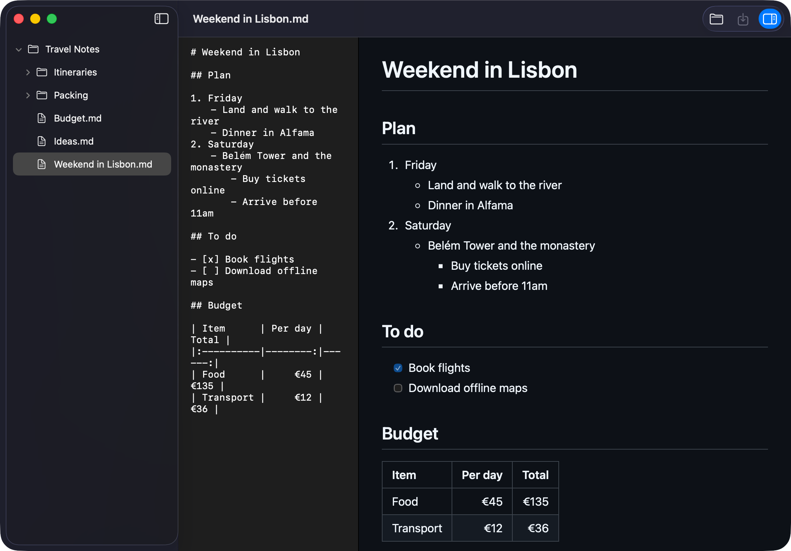

<p align="center">
  
</p>

# Markdown Editor

A small, fast, native markdown editor for macOS. Open a folder of notes, write in plain text, and watch a live
GitHub-style preview beside it. It works offline, and your notes stay ordinary `.md` files on disk.



## Install

You don't need to download the source code.

1. Go to the [**Releases** page](https://github.com/bigj3rm/mac-markdown-editor/releases/latest) and download the
   latest `Markdown-Editor-x.y.z.dmg`.
2. Open the disk image and drag **Markdown Editor** onto **Applications**.
3. The first time you open it, macOS will say it can't verify the app, because it isn't signed with a paid Apple
   developer certificate. Click **Done**, open **System Settings → Privacy & Security**, scroll to the Security
   section, click **Open Anyway** next to Markdown Editor, and confirm. You only need to do this once.

Requires a Mac with Apple silicon, running macOS 26.6 or later.

## Features

- **Folder tree.** Browse a folder's subfolders and `.md` files. Folders load when you expand them, so large
  folders stay quick.
- **Editor.** Monospaced plain text with full undo. Smart quotes and dashes are off, so your markdown is never
  silently rewritten.
- **Live preview.** Toggle it from the toolbar. It covers headings, emphasis, strikethrough, code, quotes,
  nested lists, task lists, tables with alignment, links, images and rules, in light and dark mode, and it keeps its
  scroll position as you type.
- **New files.** **File → New Markdown…** (⌘N) creates an empty file in the folder you have selected. It adds
  `.md` for you and never overwrites an existing file.
- **Your work is protected.** Unsaved edits are flagged, and the app asks before you switch files, open another
  folder, close the window or quit. If a file is changed by another program, you choose whether to reload it.
  If it is deleted, its text stays in the editor so you can save it again.
- **Private.** The app never uses the network, and it is sandboxed to the folders you open. Raw HTML in a
  document is shown as text rather than run. Images show only if they are local files inside the opened folder.

## Build from source

Open `markdown-editor.xcodeproj` in Xcode 27 or later and press **⌘R**. The only dependency is
[swift-markdown](https://github.com/swiftlang/swift-markdown), which Xcode fetches automatically.

Run the tests with:

```bash
xcodebuild -project markdown-editor.xcodeproj -scheme markdown-editor -destination 'platform=macOS' test
```

The code is organized into `Models`, `Services`, `Stores`, `Markdown` and `Views` folders. Conventions are
written down in [`CLAUDE.md`](CLAUDE.md).

## Publishing a release

Releases are built by GitHub, not on a personal machine. Open the repository's **Actions** tab, choose
**Release**, click **Run workflow**, and enter a version such as `1.0.0`. The workflow builds the `main`
branch, runs the tests, packages the `.dmg`, and publishes it on the Releases page.

## Known limitations

- Only local images are supported; remote images are deliberately not loaded.
- One window and one open folder at a time, and no Save As, rename or delete. Use Finder for those; the app
  notices the changes when you return to it.

## License

[MIT](LICENSE)
