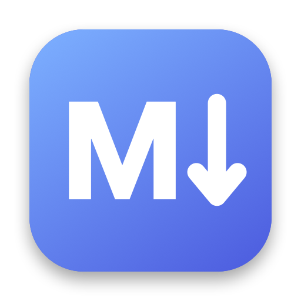

<p align="center">
  
</p>

# Markdown Editor

A small, fast, native markdown editor for macOS. Open a folder of notes, edit them as plain text, and watch a
live GitHub-style preview next to your writing.

It is built with SwiftUI and AppKit, works entirely offline, and keeps your files as ordinary `.md` files on disk.
There is no database, no account, and no sync service.

## Why

Plenty of apps can render markdown, but many are heavyweight, store notes in their own format, or want an
account. This app aims to do one thing well: let you browse a folder of markdown files, write in them without
friction, and never lose your work.

## Features

### Writing
- **Folder tree.** Open any folder and browse its subfolders and `.md` files in the sidebar. Folders are read
  only when you expand them, so large folders stay quick.
- **Plain-text editor.** A monospaced editor with full undo. Smart quotes and dashes are turned off so your
  markdown is never silently rewritten.
- **New files.** **File → New Markdown…** (⌘N) creates an empty `.md` file in the folder you have selected
  (a selected folder, the folder of a selected file, or the root). It adds `.md` for you and never overwrites
  an existing file.

### Live preview
- **Side-by-side preview** you can toggle from the toolbar, styled like GitHub, with automatic light and dark
  mode.
- Covers headings, emphasis, strikethrough, inline code, fenced code blocks, block quotes, ordered and
  unordered lists, task-list checkboxes, tables with column alignment, links, images, horizontal rules and
  line breaks.
- **Stays smooth.** Updates are debounced while you type, and the preview keeps its scroll position when it
  refreshes.
- **Local images.** Images referenced by relative path (for example `images/diagram.png`) show up, as long as
  they are inside the folder you opened.

### Never lose your work
- **Unsaved-changes indicator** and ⌘S to save. You are asked before switching files, opening another folder,
  closing the window or quitting with unsaved edits.
- **Notices changes made elsewhere.** When you return to the app (and just before saving), it checks the open
  file against the disk. If another program changed it, you choose whether to reload or keep your version.
  Saving never silently overwrites someone else's edit.
- **Deleted files keep their text.** If the open file is deleted or moved, your text stays in the editor with a
  banner, so you can copy it out or save it to recreate the file.
- The folder tree refreshes when you come back to the app.

### Private and safe by design
- **Offline.** The app never uses the network. Remote images are not loaded, and a Content-Security-Policy in the
  preview blocks every request except local images.
- **Raw HTML is shown as text,** never run. All text is escaped before it reaches the preview, and links open
  in your default browser rather than inside the app.
- **Sandboxed.** The app can only read and write the folders you choose.

## Requirements

- macOS 26.6 or later
- Xcode 27 or later to build it

## Build and run

1. Clone the repository and open `markdown-editor.xcodeproj` in Xcode.
2. Select the **markdown-editor** scheme and press **⌘R**.

The only dependency is [swift-markdown](https://github.com/swiftlang/swift-markdown), which Xcode downloads
automatically the first time you build.

To make a standalone app, build the Release configuration:

```bash
xcodebuild -project markdown-editor.xcodeproj -scheme markdown-editor -configuration Release -destination 'platform=macOS' -derivedDataPath build build
```

The app is created at `build/Build/Products/Release/markdown-editor.app`. Drag it into `/Applications`.

> The app is not code-signed with a developer certificate or notarized. It runs fine on the Mac that built it. On
> another Mac, right-click the app and choose **Open** the first time.

## Tests

```bash
xcodebuild -project markdown-editor.xcodeproj -scheme markdown-editor -destination 'platform=macOS' test
```

The tests use [Swift Testing](https://developer.apple.com/documentation/testing) and cover file handling, the
unsaved-changes and outside-change rules, tree selection, new-file creation and the markdown renderer's escaping
and output.

## How it is organized

```
markdown-editor/
├── Models/      Plain data and state rules (the open document, file names, tree rows)
├── Services/    File reading and writing, system dialogs, the local image loader
├── Stores/      Observable state for the workspace and the preview
├── Markdown/    The markdown-to-HTML renderer and the preview's styling
└── Views/       SwiftUI views and the AppKit text and web views they wrap
markdown-editorTests/
```

Views only display things. State lives in the stores, file access lives in `FileService`, and every question
the app asks you goes through a small protocol, so the logic can be tested without any windows. Contributor
conventions are written down in [`CLAUDE.md`](CLAUDE.md).

## Known limitations

- Only local images are supported; remote images are deliberately not loaded.
- The preview cannot tell tight lists from loose ones, so every list is rendered in the compact style.
- One window and one open folder at a time.
- No "Save As", rename or delete commands yet. Use Finder for those; the app picks up the changes.

## License

[MIT](LICENSE)
